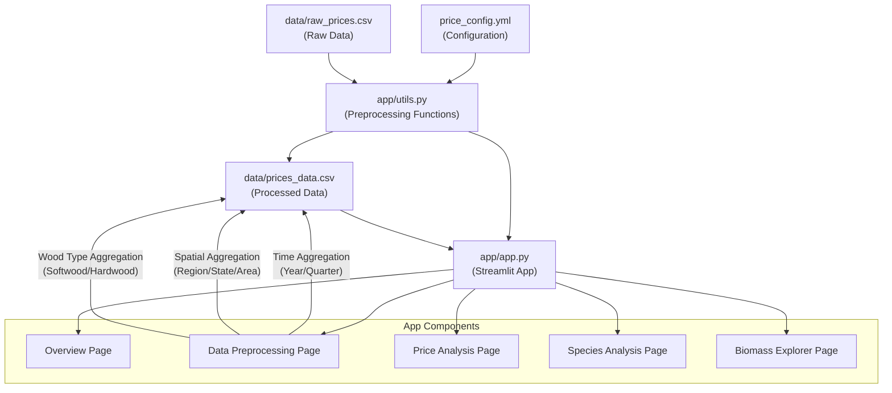

# NCA Timber Data Explorer

A Streamlit application for visualizing and exploring timber data in the Southern United States.

## Features

- **Overview**: Get a quick summary of all available datasets
- **Price Analysis**: Explore timber prices across different states, products, and time periods
- **Species Analysis**: Analyze species distribution and compare species across states
- **Biomass Explorer**: Investigate merchantable and pre-merchantable biomass data by county and species
- **Data Preprocessing**: Preprocess raw timber data with configurable aggregation options

## Data Files

The application uses the following data files:

- `data/raw_prices.csv`: Raw timber prices data
- `data/prices_data.csv`: Processed timber prices (created by preprocessing)
- `south_species.csv`: Species information across southern states
- `south_bio_merch.csv`: Merchantable biomass data
- `south_bio_premerch.csv`: Pre-merchantable biomass data

## Configuration

The application uses a YAML configuration file (`price_config.yml`) to define preprocessing options:

- Time-based aggregation (Year/Quarter)
- Spatial aggregation (Region/State/Area)
- Wood type aggregation (Softwood/Hardwood)

## Application Architecture

The application follows this data flow architecture:



### Flow Description

1. Raw data (`data/raw_prices.csv`) and configuration (`price_config.yml`) are inputs to the system
2. Preprocessing functions in `app/utils.py` handle:
   - Data cleaning
   - Aggregation by time dimensions (Year/Quarter)
   - Aggregation by spatial dimensions (Region/State/Area)
   - Aggregation by wood type (Softwood/Hardwood)
3. Processed data is saved to `data/prices_data.csv` and used by the Streamlit app
4. The Streamlit app (`app/app.py`) provides several analysis pages:
   - Overview
   - Data Preprocessing
   - Price Analysis
   - Species Analysis
   - Biomass Explorer

## Setup

1. Create a virtual environment using uv:

```bash
uv venv .venv
source .venv/bin/activate  # On Windows: .venv\Scripts\activate
```

2. Install dependencies:

```bash
uv pip install -r requirements.txt
```

## Running the App

```bash
./run_app.sh
```

Or manually:

```bash
streamlit run app/app.py
```

The app will open in your default web browser at http://localhost:8501.

## Preprocessing Options

The app includes built-in preprocessing through:

1. **Data Preprocessing page** - Dedicated page with full options
2. **Sidebar controls** - Quick access to preprocessing options

Preprocessing allows you to:
- Aggregate by time levels (Year/Quarter)
- Aggregate by spatial levels (Region/State/Area)
- Aggregate by wood type (Softwood/Hardwood)
- Choose aggregation methods (mean, sum, both)

## Screenshots

- Overview page: Basic statistics and data preview
- Price Analysis: Interactive charts showing timber price trends
- Species Analysis: Species distribution and comparison visualizations
- Biomass Explorer: County-level biomass data exploration

## License

This project is licensed under the MIT License. 